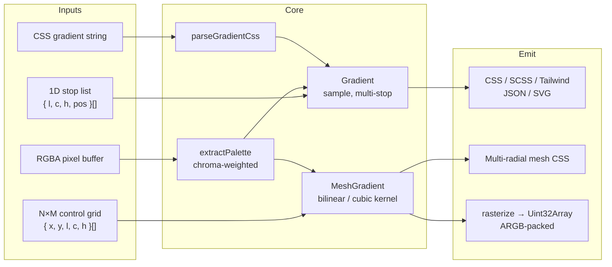

# @zakkster/lite-gradient-studio

> Authoring engine for OKLCH gradients -- linear, radial, conic, and N×M mesh -- with zero-GC rasterization, multi-format export, and chroma-weighted palette extraction.

[](https://www.npmjs.com/package/@zakkster/lite-gradient-studio)
[](https://github.com/sponsors/PeshoVurtoleta)

[](https://bundlephobia.com/result?p=@zakkster/lite-gradient-studio)
[](https://www.npmjs.com/package/@zakkster/lite-gradient-studio)
[](https://www.npmjs.com/package/@zakkster/lite-gradient-studio)

[](https://opensource.org/licenses/MIT)

**Everything you need to build a gradient editor, except the UI.**

---

## Why This Library

If you're building anything that *creates* gradients (a design tool, a theme builder, a Figma plugin, a card-generator backend, a procedural background system), you need a lot of small pieces working together: color interpolation that doesn't go through dead grey, a mesh kernel that doesn't cost 400ms per frame, CSS emitters that round-trip, format exporters for handoff, and a palette extractor that picks the vivid blue instead of all five shades of the dominant skin tone.

This library is those pieces. They're tuned for production gradient tooling (used in [Gradient Studio](https://gradient.studio)), tested at 200 cases, and built to compose — `lite-gradient-studio` is the **authoring layer** that sits between low-level color math (`@zakkster/lite-color`) and an editor UI.

- **OKLCH-native** — every interpolation, every emission, every export carries OKLCH through. No silent sRGB lerp.
- **N×M mesh kernel** — bilinear (smooth) or Catmull-Rom (cubic) over a deformable control grid. Rasterizes 65K pixels per call at >2M px/sec.
- **Multi-format exporters** — CSS, CSS variables, SCSS, Tailwind config, JSON, SVG; single-call `toTokens1d(format, state)` dispatch.
- **CSS round-trip** — `parseGradientCss()` reads what your `formatCssLinear()` writes (and what designers paste in from elsewhere).
- **Palette extraction that's not stupid** — chroma-weighted hue-bucketing means a photo of a baby in a blue shirt produces a palette that includes blue, not five variants of skin.
- **Zero-GC hot path** — `sampleAt(u, v, out)`, `lerpOklchTo(a, b, t, out)` mutate caller-owned scratch; `rasterizeTo` writes Uint32Array directly.
- **No build step** — pure ESM, ships as `src/*.js`. Vendor it or `npm i` it.

## Installation

```bash
npm install @zakkster/lite-gradient-studio
```

Dependencies (`@zakkster/lite-color`, `@zakkster/lite-color-engine`, `@zakkster/lite-gradient`) install automatically — no peer-dep dance.

## Quick Start

### 1D gradient (linear / radial / conic)

```javascript
import { Gradient, formatCssLinear } from '@zakkster/lite-gradient-studio';

const sunset = new Gradient([
    { l: 0.42, c: 0.22, h: 270, pos: 0.0 },  // deep purple
    { l: 0.65, c: 0.26, h: 320, pos: 0.5 },  // vivid magenta
    { l: 0.82, c: 0.18, h:  55, pos: 1.0 },  // warm gold
]);

// Sample at any t — zero allocation with caller scratch.
const scratch = { l: 0, c: 0, h: 0, a: 1 };
sunset.at(0.5, scratch);   // → { l: 0.65, c: 0.26, h: 320, a: 1 }

// Emit CSS with the OKLCH interpolation hint.
formatCssLinear(sunset, { angle: 135, oklchInterp: true });
// → "linear-gradient(135deg in oklch, oklch(0.42 0.22 270) 0%, ...)"
```

### Mesh gradient

```javascript
import { MeshGradient } from '@zakkster/lite-gradient-studio';

const mesh = new MeshGradient(3, 3, [
    // Row-major: top-left → top-right → ... → bottom-right
    { l: 0.42, c: 0.22, h: 250 }, { l: 0.55, c: 0.25, h: 290 }, { l: 0.62, c: 0.24, h: 330 },
    { l: 0.55, c: 0.22, h: 280 }, { l: 0.65, c: 0.26, h: 320 }, { l: 0.72, c: 0.22, h:   0 },
    { l: 0.68, c: 0.18, h: 320 }, { l: 0.78, c: 0.20, h:  30 }, { l: 0.82, c: 0.18, h:  60 },
]);

// Sample at any (u, v) ∈ [0,1]²
const scratch = { l: 0, c: 0, h: 0, a: 1 };
mesh.sampleAt(0.5, 0.5, scratch, 'smooth');

// Deform a handle — drag from regular grid to anywhere in unit square.
mesh.setPointPosition(/*col*/ 2, /*row*/ 0, /*x*/ 1.15, /*y*/ -0.05);

// Rasterize into a pre-allocated Uint32Array (ARGB-packed, sRGB).
const W = 1600, H = 640;
const buf = new Uint32Array(W * H);
mesh.rasterizeDeformedTo(buf, W, H, { mode: 'smooth' });

// Blit to canvas without re-allocating the wrapper.
const img = new ImageData(new Uint8ClampedArray(buf.buffer), W, H);
ctx.putImageData(img, 0, 0);
```

### Multi-format export

```javascript
import { toTokens1d, EXPORT_FORMATS_1D } from '@zakkster/lite-gradient-studio';

const state = { mode: 'linear', angle: 135, stops: sunset.stops };

toTokens1d('css',      state, { name: 'sunset' });   // → "background: linear-gradient(...)"
toTokens1d('css-var',  state, { name: 'sunset' });   // → "--sunset: linear-gradient(...);"
toTokens1d('scss',     state, { name: 'sunset' });   // → "$sunset: linear-gradient(...);"
toTokens1d('tailwind', state, { name: 'sunset' });   // → Tailwind config snippet
toTokens1d('json',     state, { name: 'sunset' });   // → portable JSON
toTokens1d('svg',      state, { name: 'sunset' });   // → standalone SVG with <linearGradient>

EXPORT_FORMATS_1D;
// → ['css', 'css-var', 'scss', 'tailwind', 'json', 'svg']
```

### Palette extraction from an image

```javascript
import { extractPalette } from '@zakkster/lite-gradient-studio';

// Get RGBA pixel data however you want. canvas.getContext('2d').getImageData(...) is typical.
const palette = extractPalette(rgba.data, 5);
// → [{ l, c, h }, { l, c, h }, ...] — 5 picks, chroma-weighted, hue-separated.
//   A blue-shirted-baby photo returns blue + warm tones, not five skin variants.
```

## Architecture



Each box is one module under `src/` with one test file under `test/`. Modules compose; no module reaches into another's internals.

## API Reference

### `Gradient` (re-exported from `@zakkster/lite-gradient`)

| Method | Description |
|---|---|
| `new Gradient(stops)` | Construct from sorted `{ l, c, h, pos }[]`. |
| `at(t, out)` | Zero-GC sample at `t ∈ [0,1]`. Writes into caller-owned `out`. |
| `.stops` | Read-only sorted stop list. |

### `MeshGradient`

| Method | Description |
|---|---|
| `new MeshGradient(cols, rows, stops?)` | Construct N×M mesh. If `stops` omitted, fills with a default theme. |
| `sampleAt(u, v, out, mode)` | Sample at `(u, v) ∈ [0,1]²`. `mode`: `'linear' \| 'smooth' \| 'cubic'`. Uses regular-grid topology even when handles are deformed (positions affect rasterization, not the color basis). |
| `setPointPosition(col, row, x, y)` | Move a control point to `(x, y)`. Not clamped — handles can go outside the unit square. |
| `setPointColor(col, row, l, c, h, a?)` | Mutate the color at a control point. |
| `rasterizeTo(out, w, h, opts)` | Fast path — assumes regular grid. Writes ARGB-packed Uint32Array. |
| `rasterizeDeformedTo(out, w, h, opts)` | Honors `(x, y)` deformation via Newton inverse-bilinear. Per-pixel cost ~3-5× of `rasterizeTo`. |
| `.cols` `.rows` `.stops` | Read-only mesh structure. |

`opts.mode`:
- `'linear'` — bilinear OKLCH. Fastest. Smooth between adjacent stops, faceted at cell borders.
- `'smooth'` — bilinear with smoothstep-eased u/v. Softens cell-border artifacts.
- `'cubic'` — Catmull-Rom across cell boundaries. Smoothest; ~2.5× the cost of `'linear'`.

### CSS emitters

| Function | Description |
|---|---|
| `formatCssLinear(gradient, opts)` | `linear-gradient(...)` with optional `in oklch` hint. |
| `formatCssRadial(gradient, opts)` | `radial-gradient(...)` — `shape`, `position`, hint. |
| `formatCssConic(gradient, opts)` | `conic-gradient(...)` — `from`, `position`, hint. |
| `formatCssMesh(mesh)` | Multi-radial approximation. Layers one radial per stop. Renders the visual without canvas support. |

Each emitter preserves the original `pos` values; no resampling.

### Multi-format export

| Function | Description |
|---|---|
| `toTokens1d(format, state, opts?)` | Dispatch on format id. |
| `toTokensMesh(format, mesh, opts?)` | Same, for mesh. |
| `EXPORT_FORMATS_1D` | Frozen array of supported 1D format ids. |
| `EXPORT_FORMATS_MESH` | Frozen array of supported mesh format ids. |
| `FORMAT_META` | `{ [id]: { label, hint } }` — UI metadata. |

Direct format functions are also exported (`toCss1d`, `toScss1d`, `toTailwind1d`, etc.) for when you want to skip the dispatcher.

### CSS parsing

| Function | Description |
|---|---|
| `parseGradientCss(css)` | Parse `linear-gradient(...)`, `radial-gradient(...)`, or `conic-gradient(...)`. Returns `{ mode, angle?, shape?, stops, ... }` matching the state shape exporters expect. Round-trips with the emitters above. |

### Color conversion

| Function | Description |
|---|---|
| `toHex({ l, c, h, a? })` | OKLCH → `'#rrggbb'` or `'#rrggbbaa'` with sRGB gamut clip. |
| `fromHex(hexStr)` | Hex → `{ l, c, h, a }`. |
| `oklchToLinearSrgb(L, C, H, out?)` | OKLCH → linear sRGB. With `out` (a 3-element array), writes in place and returns it (zero allocation). Without `out`, allocates a fresh array. Gamut-mapped via 10-iteration chroma binary search when out of sRGB. |
| `linearSrgbToOklch(r, g, b, out?)` | Inverse. With `out` (a `{l,c,h}` object), writes in place and returns it. The `a` field is left untouched so callers can plumb alpha through the shared object. |
| `srgbGamma(c)` / `srgbInverseGamma(c)` | sRGB transfer function (8-bit `[0, 255]`). |

### Palette extraction

| Function | Description |
|---|---|
| `extractPalette(pixels, count)` | Chroma-weighted picks with ≥50° hue separation between picks. Skips shadows (`L < 0.10`) and near-neutrals (`C < 0.02`). |

### Rasterization utilities

| Function | Description |
|---|---|
| `packOklchSingle(l, c, h, a?)` | Single OKLCH → ARGB-packed `Uint32`. |
| `bakeGradientToLut(gradient, lut, size)` | Pre-bake a 1D gradient into a Uint32Array LUT for cheap sampling. |
| `sampleLut(lut, t)` | Read a baked LUT. |
| `flattenStopsToBuffer(stops, buf)` | Write OKLCH stops to a flat Float32Array (GPU upload friendly). |

## Benchmarks

Node v22, single thread, Linux x64. Run yourself: `npm run bench`.

| Operation                                     | Throughput     |
|-----------------------------------------------|----------------|
| `Gradient.at(t)` — 5 stops, sweep             | ~30 M ops/sec  |
| `Gradient.at(t)` — single call                | ~9.4 M ops/sec |
| `MeshGradient.sampleAt(u, v)` — 5×5 smooth    | ~4.9 M ops/sec |
| `MeshGradient.sampleAt(u, v)` — 5×5 cubic     | ~1.9 M ops/sec |
| `rasterizeTo` — 5×5 → 256×256                 | ~2.1 M px/sec  |
| `rasterizeDeformedTo` — 5×5 → 256×256         | ~2.1 M px/sec  |
| `packOklchSingle` — one pixel                 | ~2.4 M ops/sec |
| `formatCssLinear` — 3 stops                   | ~360 K ops/sec |
| `toCssMesh` — 5×5 multi-radial                | ~30 K ops/sec  |
| `parseGradientCss` — 3-stop linear            | ~68 K ops/sec  |
| `extractPalette` — 240×240 RGBA, k=5          | ~41 calls/sec  |

At 60 fps you have 16.6 ms per frame. A 1600×640 mesh raster lands well inside that on this hardware; deformed rasters at the same size sit around 8-12 ms in browser benchmarks (V8/Chrome) — the offscreen-canvas quarter-res pattern shown in [Gradient Studio](https://gradient.studio)'s `mesh/render.js` keeps drag-time interaction at full 120 Hz.

## Comparison

| Feature | lite-gradient-studio | chroma.js | culori | colorjs.io | d3-color |
|---|---|---|---|---|---|
| OKLCH interpolation | ✔ | ✔ | ✔ | ✔ | ✔ |
| N×M mesh kernel     | ✔ | ✘ | ✘ | ✘ | ✘ |
| Deformable mesh handles | ✔ | ✘ | ✘ | ✘ | ✘ |
| Multi-radial mesh CSS emit | ✔ | ✘ | ✘ | ✘ | ✘ |
| Zero-GC sample API  | ✔ | ✘ | ✘ | ✘ | ✘ |
| Direct `Uint32Array` rasterize | ✔ | ✘ | ✘ | ✘ | ✘ |
| Multi-format export (CSS/SCSS/Tailwind/SVG) | ✔ | partial | partial | ✘ | ✘ |
| CSS gradient string parser | ✔ | ✘ | ✘ | ✘ | ✘ |
| Chroma-weighted palette extract | ✔ | ✘ | ✘ | ✘ | ✘ |
| No build step (pure ESM) | ✔ | ✔ | ✔ | ✔ | ✔ |

`chroma.js` / `culori` / `colorjs.io` are excellent general color libraries. **`lite-gradient-studio` is the missing layer above them** — the bit that turns OKLCH math into a gradient-editor backend.

## Use Cases

- **Gradient editor UIs** — sliders, handles, mesh deformation, export modal. This library is the engine; you supply the React/Vue/whatever.
- **Theme builders** — extract palette from brand image, emit Tailwind tokens.
- **Figma plugins** — import gradient, edit OKLCH-correctly, export back as a frame fill.
- **Procedural backgrounds** — generate mesh gradients from seed colors at build time, ship pre-baked CSS.
- **Card / OG-image generators** — server-side rasterize a gradient into PNG.
- **Game development** — perceptually-uniform color ramps for heatmaps, palette cycling, HUD elements.

## Design Principles

- **One module, one job.** `mesh.js` doesn't know about CSS. `css-emitters.js` doesn't know how to sample a gradient. Composable through the index re-exports.
- **Caller owns memory in hot paths.** `sampleAt(u, v, out)` writes into `out` you allocated once. No `{l, c, h}` object per pixel.
- **Position fidelity.** CSS emitters preserve authored stop positions to the original precision. No resampling that designers would notice and complain about.
- **The math you'd want.** Bilinear, Catmull-Rom, Newton inverse-bilinear, OKLCH ↔ sRGB matrix, gamut clip via boundary search — all the standard recipes, no clever shortcuts that turn out wrong.
- **Test-pass before shape.** 200 tests over ~2,500 lines; every module has its file in `test/`. Refactor with confidence.

## Versioning

Semantic. Pre-1.0.0 was internal-only; 1.0.0 is the first npm publish and locks the public API surface listed above. Breaking changes will land in 2.x with a migration note in `CHANGELOG.md`.

## License

MIT © Zahary Shinikchiev

## See Also

- [`@zakkster/lite-color`](https://www.npmjs.com/package/@zakkster/lite-color) — the OKLCH color math this builds on
- [`@zakkster/lite-gradient`](https://www.npmjs.com/package/@zakkster/lite-gradient) — the 1D `Gradient` class re-exported here
- [`@zakkster/lite-hueforge`](https://www.npmjs.com/package/@zakkster/lite-hueforge) — palette/theme generation, complements this for color-system tooling
- [Gradient Studio](https://gradient.studio) — the editor this library powers
